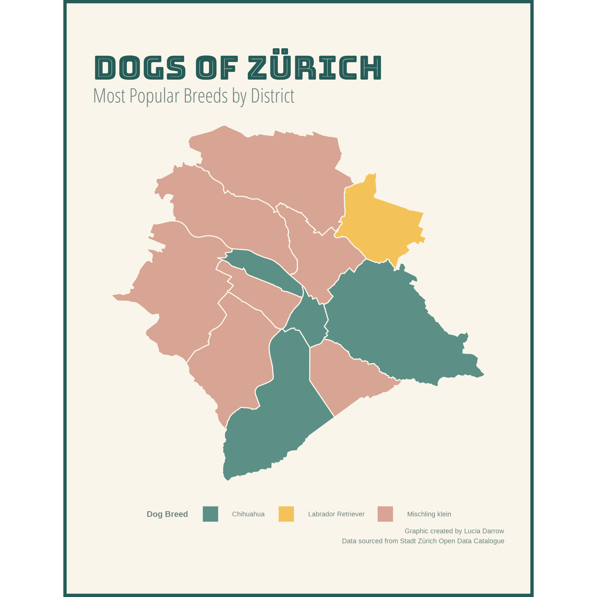
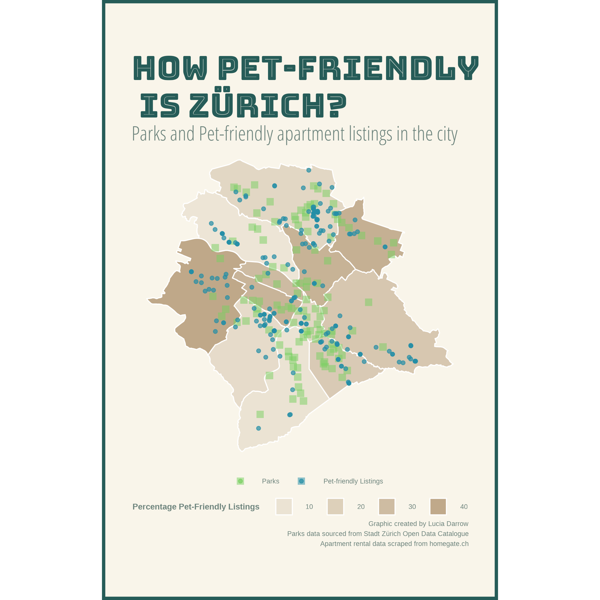

For the past few years, I've been interested in adopting a dog, but struggled to find an apartment that would allow one in Canada. At the end of May, I relocated from Vancouver, BC to Zürich, Switzerland. With its high-quality of living and access to nature, Zürich seems like an ideal place to live with a dog. So, how pet-friendly is the city of Zürich? In this post, I'll explore data provided by the city and scraped from apartment rental sites to see which neighborhoods are the most pet-friendly. 

In a city with a population of approximately 400,000, there are just over 8,500 registered dogs (according to 2021 data). Publicly available data through the Stadt Zürich Open Data portal provides the id, age, and breed of the dog, in addition to information on its owner, including their district of residence. We can use this information to better understand which areas of the city may be best for pet owners to find an apartment. 

```{r setup, include=FALSE}
knitr::opts_chunk$set(echo = FALSE, eval = TRUE, message = FALSE, warning = FALSE)
```

```{r libraries}
library(tidyverse)
library(magrittr)
library(data.table)
library(DT)
library(ggplot2)
library(stringr)
library(ggmap)
library(tidygeocoder)
library(rvest)
library(rgdal)
library(magrittr)
library(broom)

library(ggtext)
library(extrafont)
library(showtext)
library(magick)
library(sp)
library(mapproj)
library(formattable)
library(rjson)
library(geojsonio)
library(broom)
```

```{r fonts, eval=FALSE}
# Process to add new fonts
font_add_google("Ultra", "Ultra")
font_add_google("Roboto", "Roboto")
font_add_google("Bungee Inline", "Bungee Inline")
font_add_google("Alfa Slab One", "Alfa Slab One")
font_add_google("Open Sans Condensed", "Open Sans Condensed", regular.wt = 300)
# 
# # Load font from the current search path into showtext
# 
# # Check the current search path for fonts
font_paths()
# #> [1] "C:\\Windows\\Fonts"
# 
# # List available font files in the search path
font_files()
# #>   [1] "AcadEref.ttf"                                
# #>   [2] "AGENCYB.TTF"                           
# #> [428] "pala.ttf"                                    
# #> [429] "palab.ttf"                                   
# #> [430] "palabi.ttf"                                  
# #> [431] "palai.ttf"
# 
# # syntax: font_add(family = "<family_name>", regular = "/path/to/font/file")
fontsView <- font_files()
font_add("OpenSans", "OpenSans-Regular.ttf")
font_add("Roboto", "RobotoCondensed-Regular.ttf")
# 
font_families()
# #> [1] "sans"         "serif"        "mono"         "wqy-microhei"
# #> [5] "Montserrat"   "Roboto"       "Palatino"
# 
# ## automatically use showtext for new devices
showtext_auto()
```

```{r, import_dog_data}

# Read in the dog owner data from Open Data Zurich
hunde <- fread("20210301_hundehalter.csv", encoding = "UTF-8")

# Explore the count of dogs by breed in each district
hunde %>% 
  group_by(RASSE1, STADTKREIS) %>% 
  count() -> counthunde 

# Gather the top breed per district
top_breeds <- hunde %>% 
  group_by(STADTKREIS, RASSE1) %>% 
  count() %>% ungroup() %>%
  group_by(STADTKREIS) %>%
  top_n(n=1) %>%
  distinct(STADTKREIS, .keep_all = TRUE)

# Add in the title Kreis for matching 
top_breeds$id <- paste("Kreis", top_breeds$STADTKREIS)

```

Let's start by taking a look at the most popular breeds in the city. Zürich classifies dog breeds into three categories:

* **Type I**: Large dogs, defined by a height of at least 45 cm and a body weight of at least 15 kg
* **Type II**: Dogs with increased risk potential which are banned in the Canton of Zürich (e.g. Pit Bulls and Bull Terriers)
* **Type K**: Small dogs

```{r, breed_table}
# Summarize the count of breed types by city district
breed_types <- hunde %>% 
  group_by(STADTKREIS, RASSENTYP) %>% 
  count() %>% ungroup() 

breed_types$STADTKREIS <- paste("Kreis", breed_types$STADTKREIS)
breed_types <- breed_types[breed_types$RASSENTYP != "", ]

# Widen the table for display and add a total column
breed_types %<>% pivot_wider(names_from = RASSENTYP, values_from = n)
names(breed_types)[1] <- c("City District")
breed_types %<>% 
     mutate(`Total Registered Dogs` = rowSums(.[2:4], na.rm = TRUE))

breed_types[is.na(breed_types)] <- 0

customGreen0 = "#BFA889"
customGreen = "#e3d8ca"

# Create a styled formattable object
formattable(breed_types, align =c("l","r","r","r", "r"), list(
  `City District` = formatter("span", style = ~ style(color = "grey",font.weight = "bold")), 
  `Total Registered Dogs`= color_tile(customGreen, customGreen0)
))

```

This tables indicates that there are more dog owners residing in outer districts like Kreis 7 and Kreis 11, than in inner city districts. This could be simply due to the higher population in these areas. Overall, we can see that small breeds (Type K) are more common across all districts. There are only a handful of the restricted breeds (Type II) found in the city. Next, let's take a closer look at the most popular breed by district. 

```{r, spatial_json}
# Read in the spatial polygon data that defines the city districts 
stadt_kreise <- geojson_read(paste0(getwd(),"/stadtkreis/data/stzh.adm_stadtkreise_a.json"), what = "sp")
spdf_fortified <- tidy(stadt_kreise)

# Join the city district polygons to the top breed table
spdf_fortified$id <- paste("Kreis", spdf_fortified$id)
spdf_fortified %<>% left_join(top_breeds, by = "id")

# Read in dataset that locates all city parks
stadt_park <- geojson_read(paste0(getwd(),"/stadtkreis/data/stzh.poi_park_view.json"), what = "sp")
parks_df <- data.frame(stadt_park)

```

```{r breed_plot}

# Set color palette
breed_colors <- c("#5C9087", "#F3C35A", "#D8A493")

# Plot the top breeds by district
plot <- ggplot() +
  geom_polygon(data = spdf_fortified, aes( x = long, y = lat, group = group, fill = RASSE1), color="#F9F5EA") +
  theme_void() +
  coord_map() +
  scale_fill_manual(values = breed_colors) +
  theme(
    plot.background = element_rect(fill = "#F9F5EA", colour = "#265C58", size = 3),
    text = element_text(color = "#6F857E", size = 25),
    strip.text = element_text(family = "Bungee Inline", face = "bold", size = 20, colour = "#6F857E"),
    panel.grid = element_blank(),
    axis.text.x = element_blank(),
    axis.text.y = element_blank(),
    plot.margin = unit(c(17, 10, 17, 10), units = "mm"),
    legend.position="bottom",
    legend.title = element_text(face = "bold"),
    plot.title = element_text(size = 100, face = "bold", family = "Bungee Inline", color = "#265C58", lineheight=.3),
    plot.subtitle = element_text(size = 60, family ="Open Sans Condensed", lineheight=.5),
    plot.caption = element_text(lineheight=.2)
  ) +
  labs(
    x = "",
    y = "",
    fill = "Dog Breed",
    title = "Dogs of Zürich",
    subtitle = "Most Popular Breeds by District",
    caption = "Graphic created by Lucia Darrow \n 
               Data sourced from Stadt Zürich Open Data Catalogue"
  )

```

```{r save_breed_plot, eval = FALSE}
ggsave(filename = "dog_breed_plot.png", 
       plot = plot, 
       device = "png",
       type = "cairo",
       width = 8, height = 8)
```


{width=90%}


As expected, small breeds like the Chihuahua and mixed small breeds are most popular in the majority of districts. Interestingly, the Labrador Retriever is most popular in Kreis 7, which may indicate a more active lifestyle in this area. 

```{r, scrape_listings, eval=FALSE}
# Scrap the rental data from homegate
homegate_url <- "https://www.homegate.ch/rent/apartment/city-zurich/matching-list?an=2&ep="
# html_hg <- read_html(homegate_url)
# addresse <- html_nodes(html_hg, ".ListItemTopPremium_data_3i7Ca")
# addresse_text <- html_text(addresse, trim=TRUE) %>% as.data.frame()

res_all <- NULL
for (i in 0:12) {

homegate_html <- read_html(str_c(homegate_url,i))
res_pg <- tibble(  
            # addresse <- html_nodes(homegate_html, ".ListItemTopPremium_data_3i7Ca") %>% html_text() %>% as.data.frame()
            addresse <- html_nodes(homegate_html, ".ListItem_item_1GcIZ.ListItem_isFavouriteEnabled_1GRUr") %>% html_text() %>% as.data.frame()

            ) 

res_all <- res_all %>% bind_rows(res_pg)

}
full_res <- res_all_1 %>% bind_rows(res_all)
```

```{r clean_address_data, eval = FALSE}

# Read in the full set of homegate results to clean and extract addresses
addresse <- fread("homegate_all_res.csv") 
names(addresse) <- c("count", "loc")

# Capture multiple spellings of Zurich
addresse$loc <- gsub("Zurich", "Zürich", addresse$loc)

# Remove front matter, end matter and any designations
addresse %<>% mutate(loc = sub("Zürich.*", "", loc),
                     loc = sub(".*rm", "", loc),
                     loc = sub(".*m2", "", loc),
                     loc = sub("Top", "", loc),
                     loc = sub("Premium", "", loc))

addresse %<>% as.data.frame()
names(addresse) <- c("count", "loc")
addresse %<>% mutate(loc = paste0(loc, " Zürich, Switzerland"))

# geocode the addresses using OSM
osm_zuri <- geo(
  address = addresse$loc, method = "osm",
  lat = latitude, long = longitude
)

# Save these addresses for future reference
write.csv(osm_zuri, "osm_zuri.csv")

```

```{r, clean_pet_address_data}
# Read in the geocoded listings 
osm_zuri <- fread("osm_zuri.csv")

# Read in set of pet-frindly addresses
pet_addresse <- fread("homegate_pet_res.csv") 
names(pet_addresse) <- c("count", "loc")

# Capture multiple spellings of Zurich
pet_addresse$loc <- gsub("Zurich", "Zürich", pet_addresse$loc)

# Remove front matter, end matter and any designations
pet_addresse %<>% mutate(loc = sub("Zürich.*", "", loc),
                     loc = sub(".*rm", "", loc),
                     loc = sub(".*m2", "", loc),
                     loc = sub("Top", "", loc),
                     loc = sub("Premium", "", loc))

pet_addresse %<>% as.data.frame()
names(pet_addresse) <- c("count", "loc")
pet_addresse %<>% mutate(loc = paste0(loc, " Zürich, Switzerland"))

# Label these addresses as pet-friendly
pet_addresse$pet_friendly <- TRUE
pet_addresse %<>% select(-count)

# Take unique pet-friendly addresses for matching
pet_addresse <- unique(pet_addresse)

# Label pet-friendly addresses in the full set
osm_zuri %<>% left_join(select(pet_addresse, loc, pet_friendly), by = c("address" = "loc"))

# Remaining addresses are assumed not pet-friendly
osm_zuri[is.na(osm_zuri$pet_friendly), "pet_friendly"] <- FALSE
                        
# Remove addresses that did not geocode
osm_zuri <- osm_zuri[!is.na(osm_zuri$latitude),]

```

Renting is very common in Switzerland, with around 9 out of 10 people renting rather than owning property in Swiss cities. Zürich is certainly no exception. One of the most popular real estate websites in Switzerland is homegate.ch. Advertisers can choose to include whether or not their property listing is pet-friendly. In June 2021, I scraped the current 970 rental listings on homegate within the city of Zürich. The table below shows the count of listings split by city district and whether or not they are pet friendly. 

```{r, pet_friendly_table}

spdf <- SpatialPointsDataFrame(coords = osm_zuri[, c("longitude", "latitude")], data = osm_zuri,
                               proj4string = CRS("+proj=longlat +datum=WGS84 +no_defs +ellps=WGS84 +towgs84=0,0,0"))

# Remove listings that lie outside of the city boundaries
listings <- spdf[complete.cases(over(spdf, stadt_kreise)), ]

# Count up the number of listings per district that are pet-friendly vs not
listings_pet_friendly <- listings[listings$pet_friendly == TRUE,]
listings_no_pets <- listings[listings$pet_friendly == FALSE,]

res_pf <- over(listings_pet_friendly, stadt_kreise)
res_pf <- table(res_pf$bezeichnung) %>% as.data.frame()
res_pf$pet_friendly <- TRUE

res_np <- over(listings_no_pets, stadt_kreise)
res_np <- table(res_np$bezeichnung) %>% as.data.frame()
res_np$pet_friendly <- FALSE

listings_pets <- left_join(res_pf, res_np, by = "Var1")
listings_pets %<>% mutate(perc_pet_friendly = Freq.x/(Freq.x + Freq.y)*100)
listings_pets_formatted <- listings_pets %>% 
  select(Var1, Freq.x, Freq.y, perc_pet_friendly)

names(listings_pets_formatted) <- c("City District", "Count of Pet-Friendly Listings", "Count of Other Listings", "Percentage Pet-Friendly")

# Create a stylized table for the pet-friendly listings 
customGreen0 = "#BFA889"
customGreen = "#e3d8ca"
listings_pets_formatted$`Percentage Pet-Friendly` <- percent(round((listings_pets_formatted$`Percentage Pet-Friendly`/100), 4))

listings_pets_formatted$`City District` %<>% factor(ordered = TRUE, 
                                levels = paste("Kreis", 1:12))
listings_pets_formatted %<>% arrange(`City District`)

formattable(listings_pets_formatted, align =c("l","r","r","r"), list(
  `City District` = formatter("span", style = ~ style(color = "grey",font.weight = "bold")), 
  `Percentage Pet-Friendly`= color_tile(customGreen, customGreen0)
))

```

```{r, pet_friendly_plot}
# Join in the pet-friendly percentage statistic to the spatial polygon object
spdf_fortified %<>% left_join(select(listings_pets, Var1, perc_pet_friendly), by = c("id" = "Var1"))

listings <- as.data.frame(listings)
listings_with_pets <- listings[listings$pet_friendly == TRUE,]

pet_friendly_palette <- c("#78CF60", "#258EA6", "#B8A48B")

# Plot the pet-friendly districts, listings and parks data
plot <- ggplot() +
  geom_polygon(data = spdf_fortified, aes( x = long, y = lat, group = group, alpha = perc_pet_friendly), fill="#BFA889", color="white") +
  scale_alpha(range = c(0.2, 1))+
  geom_jitter(data = parks_df, shape = 15, aes( x = coords.x1, y = coords.x2, color = "Parks"),  inherit.aes = FALSE, alpha = 0.5, size = 3) +
  geom_jitter(data = listings_with_pets, shape = 19, aes( x = longitude, y = latitude, color = "Pet-friendly Listings"), inherit.aes = FALSE, alpha = 0.7, size = 1.5) +
  scale_color_manual(values = pet_friendly_palette) +
  coord_map() +
  theme_void() +
  theme(
    plot.background = element_rect(fill = "#F9F5EA", colour = "#265C58", size = 3),
    text = element_text(color = "#6F857E", size = 25),
    strip.text = element_text(family = "Bungee Inline", face = "bold", size = 20, colour = "#6F857E"),
    panel.grid = element_blank(),
    axis.text.x = element_blank(),
    axis.text.y = element_blank(),
    plot.margin = unit(c(17, 10, 17, 10), units = "mm"),
    legend.position="bottom", legend.box = "vertical",
    legend.title = element_text(face = "bold"),
    plot.title = element_text(size = 100, face = "bold", family = "Bungee Inline", color = "#265C58", lineheight=.3),
    plot.subtitle = element_text(size = 60, family ="Open Sans Condensed", lineheight=.5),
    plot.caption = element_text(lineheight=.2)
    ) + 
  guides(alpha=guide_legend(title="Percentage Pet-Friendly Listings")) +
    labs(
    x = "",
    y = "",
    fill = "Pet Friendly",
    color = NULL,
    title = "How pet-friendly \n is Zürich?",
    subtitle = "Parks and Pet-friendly apartment listings in the city",
    caption = "Graphic created by Lucia Darrow \n 
               Parks data sourced from Stadt Zürich Open Data Catalogue \n
               Apartment rental data scraped from homegate.ch"
  ) 

```

```{r save_pf_plot, eval = FALSE}
ggsave(filename = "pet_friendly_listings_plot.png", 
       plot = plot, 
       device = "png",
       type = "cairo",
       width = 8, height = 8)

```

This provides a more complete picture of pet-friendliness that the dog count table above as we start to get a sense of pets relative to total population in each district. We can also view this information graphically. In addition to showing the pet-friendly listings in each district, the plot below also shows the locations of parks across the city. 

 {width=90%}

Based on these results, it's looks like districts 3, 7 and 11 are all great places to start a search for a pet-friendly apartment. They boast both a high dog population and a large percentage of pet-friendly rentals. 

Futher analysis could look into the number of pet resources in each of these districts, including features such as number of veterinarians, dog-walkers and pet friendly restaurants or shops. 


