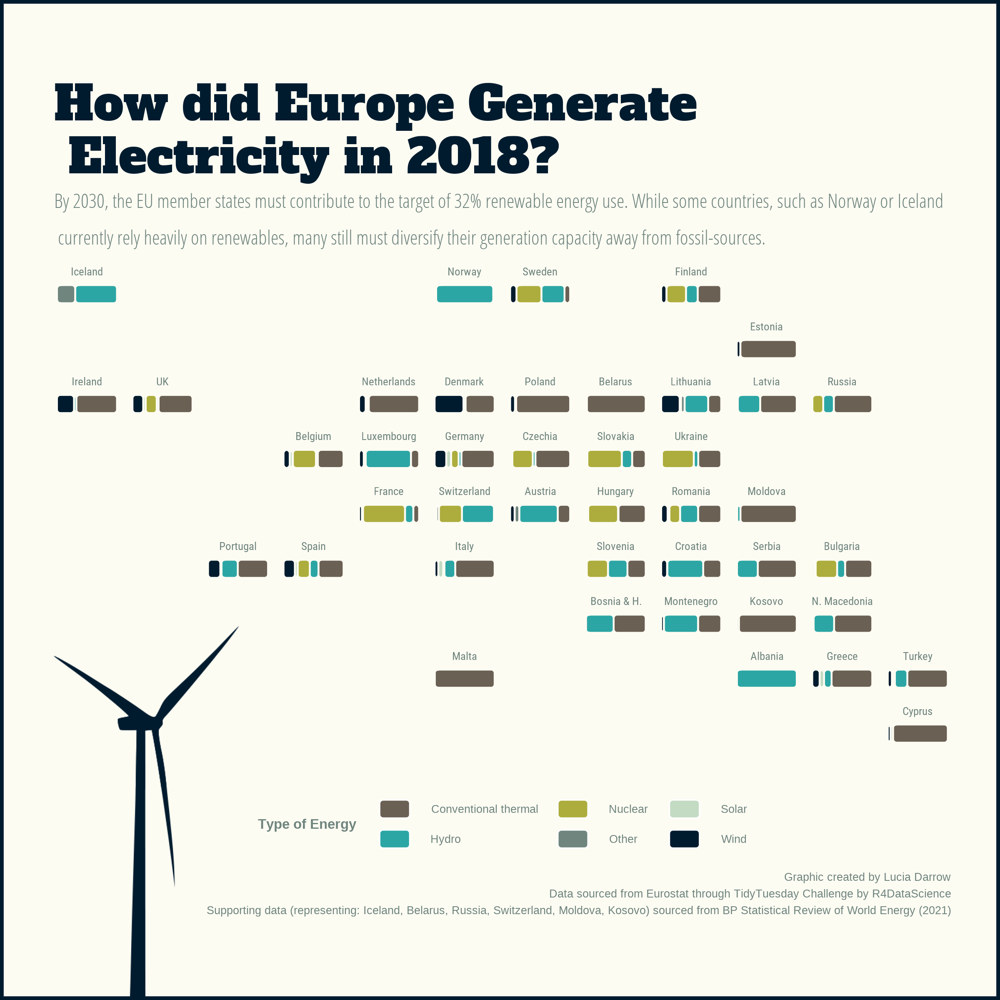

The energy landscape in Europe is rapidly changing. In this post, I used data from a 2020 TidyTuesday challenge to create an engaging visual. The resulting graphic is made using ggplot2, imagemagick and geofacet.  {width=90%}

```{r setup, include=FALSE}
knitr::opts_chunk$set(echo = FALSE, eval = FALSE)
```

```{r libraries}
library(tidyverse)
library(magrittr)
library(data.table)

library(ggplot2)
library(ggtext)
library(ggchicklet)
library(geofacet)
library(extrafont)
library(showtext)
library(magick)

#Ultra - titles
#Roboto - labels
#Opensans condensed - text

```


```{r fonts}
# Process to add new fonts
# font_add_google("Ultra", "Ultra")
# font_add_google("Roboto", "Roboto")
# font_add_google("Alfa Slab One", "Alfa Slab One")
# font_add_google("Open Sans Condensed", "Open Sans Condensed", regular.wt = 300)
# 
# # Load font from the current search path into showtext
# 
# # Check the current search path for fonts
# font_paths()    
# #> [1] "C:\\Windows\\Fonts"
# 
# # List available font files in the search path
# font_files()    
# #>   [1] "AcadEref.ttf"                                
# #>   [2] "AGENCYB.TTF"                           
# #> [428] "pala.ttf"                                    
# #> [429] "palab.ttf"                                   
# #> [430] "palabi.ttf"                                  
# #> [431] "palai.ttf"
# 
# # syntax: font_add(family = "<family_name>", regular = "/path/to/font/file")
# fontsView <- font_files()
# font_add("OpenSans", "OpenSans-Regular.ttf")
# font_add("Roboto", "RobotoCondensed-Regular.ttf")
# 
# font_families()
# #> [1] "sans"         "serif"        "mono"         "wqy-microhei"
# #> [5] "Montserrat"   "Roboto"       "Palatino"
# 
# ## automatically use showtext for new devices
showtext_auto()
```


```{r bp_data}
# Import the bp data
missing_energy_types <- fread("electricity-prod-source-stacked.csv") %>% 
  filter(Year == 2018, Entity %in% c("Iceland", "Belarus", "Russia", "Switzerland", "Moldova", "Kosovo"))

names(missing_energy_types) <- c("country_name", "country", "year", "Coal", "Gas", "Hydro", "Nuclear", "Oil", "Other", "Solar", "Wind")  

missing_energy_types %<>% pivot_longer(4:11, names_to = "type", values_to = "qty")
missing_energy_types[missing_energy_types$type %in% c("Coal", "Gas", "Oil"), "type"] = "Conventional thermal"

```


```{r data_prep}

# Access the data
# tuesdata <- tidytuesdayR::tt_load('2020-08-04')
# tuesdata <- tidytuesdayR::tt_load(2020, week = 32)
# 
# energy_types <- tuesdata$energy_types
# country_totals <- tuesdata$country_totals
# 
# write.csv(energy_types, "energy_types.csv")
# write.csv(country_totals, "country_totals.csv")

energy_types <- fread("energy_types.csv", header = TRUE)
country_totals <- fread("country_totals.csv")

# Clean up some of the country names to match the geofacet grid
energy_types %<>% 
  mutate(country_name = case_when(country_name == "Bosnia & Herzegovina" ~ "Bosnia & H.",
                                  country_name == "North Macedonia" ~ "N. Macedonia",
                                  # UK is missing country name
                                  country == "UK" ~ "UK",
                                  TRUE ~ country_name)) %>%
  filter(country_name %in% europe_countries_grid2$name) %>%
  pivot_longer(cols = c(`2016`, `2017`, `2018`), names_to = "year", values_to = "qty")
 
# Group together energy_types
energy_types[energy_types$type %in% c("Hydro", "Pumped hydro power"), "type"] = "Hydro"
energy_types[energy_types$type %in% c("Other", "Geothermal"), "type"] = "Other"

# Set energy types to factor for control in plotting
energy_types$type %<>% factor(levels = c("Conventional thermal", "Nuclear", "Hydro",  "Wind", "Solar", "Other"))                            
# Create a custom palette for the visual
energyPalette <- data.frame(type = c("Conventional thermal", "Nuclear", "Hydro",  "Wind", "Solar", "Other"),
                            customColor = c("#6B6054", "#2CA6A4", "#ADAD3E", "#6F857E", "#C3DAC3", "#001B2E")
)
energyPalette$type %<>% factor(levels = c("Conventional thermal", "Nuclear", "Hydro",  "Wind", "Solar", "Other"))  

energy_types %<>% left_join(energyPalette, by = "type")
energy_types$year %<>% as.integer()

# Add in the missing energy types data from the bp dataset
energy_types %<>% bind_rows(missing_energy_types)

```

```{r create_ggplot}
plot <- energy_types %>%
  filter(year == 2018) %>%
  group_by(country_name, year, type) %>%
  summarise(qty = sum(qty)) %>%
  ggplot(aes(year, qty, fill = type)) +
  geom_chicklet(position = "fill", radius = unit(2,units = "pt"), size = 0.5, color = "#fdfcf3") +
  coord_flip() +
  facet_geo(~ country_name, grid = "europe_countries_grid2") +
  theme_minimal() +
  theme(axis.title.y=element_blank(),
        axis.text.y=element_blank(),
        axis.ticks.y=element_blank())  +
  scale_fill_manual(values = energyPalette$customColor) +
  theme(
    plot.background = element_rect(fill = "#fdfcf3", colour = "#001B2E", size = 2),
    text = element_text(color = "#6F857E", size = 25),
    strip.text = element_text(family = "Roboto", face = "bold", size = 20, colour = "#6F857E"),
    panel.grid = element_blank(),
    axis.text.x = element_blank(),
    axis.text.y = element_blank(),
    plot.margin = unit(c(17, 10, 17, 10), units = "mm"),
    legend.position="bottom",
    legend.title = element_text(face = "bold"),
    plot.title = element_text(size = 85, face = "bold", family = "Alfa Slab One", color = "#001B2E", lineheight=.3),
    plot.subtitle = element_text(size = 35, family ="Open Sans Condensed", lineheight=.5),
    plot.caption = element_text(lineheight=.2)

  ) +
  labs(
    x = "",
    y = "",
    fill = "Type of Energy",
    title = "How did Europe Generate \n Electricity in 2018?",
    subtitle = "By 2030, the EU member states must contribute to the target of 32% renewable energy use. While some countries, such as Norway or Iceland \n currently rely heavily on renewables, many still must diversify their generation capacity away from fossil-sources.",
    caption = "Graphic created by Lucia Darrow \n 
               Data sourced from Eurostat through TidyTuesday Challenge by R4DataScience \n 
               Supporting data (representing: Iceland, Belarus, Russia, Switzerland, Moldova, Kosovo) sourced from BP Statistical Review of World Energy (2021)"
  )

plot

```

```{r save_plot}
ggsave(filename = "energy_plot.png", 
       plot = plot, 
       device = "png",
       type = "cairo",
       width = 8, height = 8)
```

```{r compose_image}

# Set ggplot result as base image
background <- image_read(paste0( "energy_plot.png"))

# Pull in the turbine image to overlay
turbine <- image_read("Blue_Turbine.png") %>% image_scale("650") # width: 300px

# Compose the two images into our final graphic
final_plot <- image_composite(background, turbine, offset = "+10+1500")

# Save final
image_write(final_plot, 'final_energy_plot.jpg')


```
